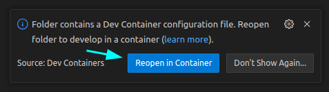
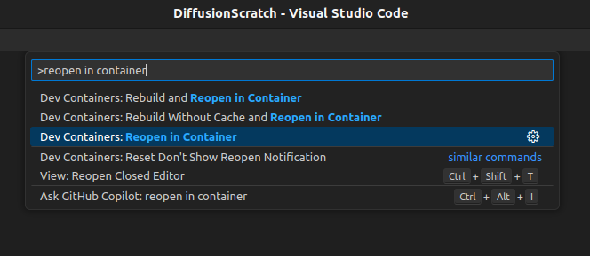
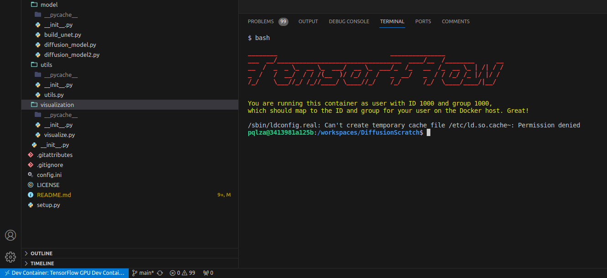

# nvidia-gpu-tensorflow

<p align="center">
    <a href="https://docs.microsoft.com/en-us/windows/wsl/install" alt="WSL2">
        </a>
    <a href="https://ubuntu.com/" alt="Ubuntu">
        </a>
    <a href="https://www.apple.com/macos/monterey-preview/" alt="MacOS">
        </a>
    <br>
    <a href="https://www.python.org/downloads/release/python-312/" alt="Python logo 3.10-3.12">
        </a>
    <a href="https://www.tensorflow.org/" alt="Tensorflow logo 2.16.1">
        </a>
    <a href="https://keras.io/" alt="Keras logo 3.1">
        </a>
    <br>
    <a href="https://www.nvidia.com/" alt="NVIDIA">
        </a>
    <a href="https://developer.nvidia.com/cuda-zone" alt="CUDA 12.3">
        </a>
    <a href="https://developer.nvidia.com/cudnn" alt="cuDNN 8.9">
        </a>
    <br>
    <a href="https://www.docker.com/" alt="Docker">
        </a>
    <a href="https://code.visualstudio.com/" alt="VS Code">
        </a>
    <a href="https://docs.conda.io/projects/conda/en/latest/user-guide/tasks/manage-environments.html" alt="Miniconda">
        </a>
    <br>
    <a href="https://opensource.org/licenses/MIT" alt="License: MIT">
        </a>
</p>

<pre>
            _     _ _                                     _                             __ _               
 _ ____   _(_) __| (_) __ _        __ _ _ __  _   _      | |_ ___ _ __  ___  ___  _ __ / _| | _____      __
| '_ \ \ / / |/ _` | |/ _` |_____ / _` | '_ \| | | |_____| __/ _ \ '_ \/ __|/ _ \| '__| |_| |/ _ \ \ /\ / /
| | | \ V /| | (_| | | (_| |_____| (_| | |_) | |_| |_____| ||  __/ | | \__ \ (_) | |  |  _| | (_) \ V  V / 
|_| |_|\_/ |_|\__,_|_|\__,_|      \__, | .__/ \__,_|      \__\___|_| |_|___/\___/|_|  |_| |_|\___/ \_/\_/  
                                  |___/|_|                                                                 
</pre>

## :scroll: Introduction

This repository is a step-by-step guide for using NVIDIA GPU's on Windows (WSL2) and Linux (Ubuntu) and MacOs GPU's with **TensorFlow**. 

It includes the installation of the necessary drivers, CUDA and cuDNN libraries, and the configuration of the environment to use the GPU with TensorFlow. Also, it includes the a [.devcontainer](./.devcontainer) congifuration folder to use as a template to develop your own TensorFlow project with GPU support in Docker and a [setup.py](./setup.py) file to install the external dependencies of the project.

Even though the **.devcontainer** folder and the **setup.py** file are templates, they are ready to use for a TensorFlow project with GPU support by just following the steps in the guide. Just check them before using them to make sure they are compatible with your project and to add your info to the setup.py file, if using one, and .devcontainer file.

## :bookmark_tabs: Guide Structure

The **structure** of the repository is as follows:

```tree
📦nvidia-gpu-tensorflow
 ┣ 📂.devcontainer -----------------------> # Devcontainer configuration folder template (ready to use)
 ┃ ┣ 📜devcontainer.json
 ┃ ┗ 📜Dockerfile
 ┣ 📂figures
 ┣ 📜LICENSE
 ┣ 📜README.md
 ┗ 📜setup.py -----------------------------> # External dependencies installation template file (ready to use)
```

## :computer: Setup

It is **recommended** to use a **`Linux (Ubuntu)`** distribution for this project, since it is the most common OS for data science and artificial intelligence tasks and for that reason, NVIDIA GPU configurations are easier to set up.

Not only that, but also because is the simplest way to configure and maintain the project code overtime since we will be using a Docker container, avoiding any compatibility issues with the OS and if the is any issue update or upgrade, it can be easily resolved by just rebuilding the container.

However, you can also use `Windows` with `WSL2` or `MacOS`. The requirements for each OS are as follows:

<table>
    <thead>
        <tr>
            <th>Windows</th>
            <th><span style="background-color: #e68a00">Linux (Ubuntu) recommended</span></th>
            <th><a href="https://developer.apple.com/metal/tensorflow-plugin/">MacOS</a></th>
        </tr>
    </thead>
    <tbody>
        <tr>
            <td>
                <ul>
                    <li>Windows 11</li>
                    <li>NVIDIA GPU with CUDA support</li>
                    <li><a href="https://learn.microsoft.com/en-us/windows/wsl/install">Download and set up WSL2</a>
                    <li>Install Ubuntu from the Microsoft Store</li>
                    <hr>
                    <li>Follow the configuration steps: </br>
                        <ul>
                            <li><a href="#1-nvidia-gpu-configuration-windows-and-linux">NVIDIA GPU Configuration</li>
                            <li><a href="#2-windows-subsystem-for-linux-wsl2-configuration">WSL2 Configuration</a></li>
                        </ul>
                </ul>
            </td>
            <td>
                <ul>
                    <li>Ubuntu 22.04 or later</li>
                    <li>NVIDIA GPU with CUDA support</li>
                    <li><a href="https://docs.docker.com/engine/install/ubuntu/">Install Docker on Ubuntu</a></li>
                    <hr>
                    <li>Follow the configuration steps: </br>
                        <ul>
                            <li><a href="#1-nvidia-gpu-configuration-windows-and-linux">NVIDIA GPU Configuration</li>
                            <li><a href="#3-linux-ubuntu-configuration">Linux Configuration</a></li>
                        </ul>
                </ul>
            </td>
            <td>
                <ul>
                    <li>macOS 12.0 or later (Get the latest beta)</li>
                    <li>Mac computer with Apple silicon or AMD GPUs</li>
                    <li>Python version 3.10 or later</li>
                    <li>Xcode command-line tools: <code>xcode-select — install</code></li>
                    <hr>
                    <li>Follow the configuration steps: </br>
                        <ul>
                            <li><a href="#4-macos-configuration">MacOS Configuration</a></li>
                        </ul>
                </ul>
            </td>
        </tr>
    </tbody>
</table>

## :wrench: OS Configuration

### 1. NVIDIA GPU Configuration (Windows and Linux)
---

In order to use the GPU with tensorflow, you need to install the **NVIDIA drivers**, **CUDA** and **cuDNN**.

Eventhough the project is developed in Tensorflow and therefore not all CUDA and cuDNN versions are compatible with the version of Tensorflow used, for the GPU to work properly, the versions of CUDA and cuDNN and the NVIDIA drivers must be the most recent ones.

#### 1.1 Install NVIDIA drivers:

<table>
    <thead>
        <tr>
            <th>Windows</th>
            <th>Linux (Ubuntu)</span></a></th>
        </tr>
    </thead>
    <tbody>
        <tr>
            <td>
                <ul>
                    <li>Download the latest NVIDIA drivers </br> for your GPU on Windowns from the <a href="https://www.nvidia.com/download/index.aspx?lang=en-us">NVIDIA website</a></li>
                    <li>Install the <code>.exe</code> file</li> and follow the instructions
                    <li>Chech the driver installation: </br>
                    <code>nvidia-smi</code></li>
                </ul>
            </td>
            <td>
                <ul>
                    <li> Update and upgrade the system: </br>
                    <code>sudo apt update && sudo apt upgrade</code></li>
                    <li> Remove previous NVIDIA installations: </br>
                    <code>sudo apt autoremove nvidia* --purge</code></li>
                    <li> Check Ubuntu drivers devices: </br>
                    <code>ubuntu-drivers devices</code></li>
                    <li> Install the recommended NVIDIA driver (its version is tagged with recommended): </br>
                    <code>sudo apt-get install nvidia-driver-&ltdriver_number&gt</code></li>
                    <li> Reboot the system: </br>
                    <code>reboot</code></li>
                    <li>Chech the driver installation: </br>
                    <code>nvidia-smi</code></li>
                </ul>
            </td>
        </tr>
    </tbody>
</table>

After these steps, when executing the `nvidia-smi` command, you should see the following output:

```bash
user@user:~$ nvidia-smi
+-----------------------------------------------------------------------------------------+
| NVIDIA-SMI 550.54.15              Driver Version: 550.54.15      CUDA Version: 12.4     |
|-----------------------------------------+------------------------+----------------------+
| GPU  Name                 Persistence-M | Bus-Id          Disp.A | Volatile Uncorr. ECC |
| Fan  Temp   Perf          Pwr:Usage/Cap |           Memory-Usage | GPU-Util  Compute M. |
|                                         |                        |               MIG M. |
|=========================================+========================+======================|
|   0  NVIDIA GeForce RTX 3060 ...    Off |   00000000:01:00.0  On |                  N/A |
| N/A   41C    P8             15W /   70W |      73MiB /   6144MiB |     18%      Default |
|                                         |                        |                  N/A |
+-----------------------------------------+------------------------+----------------------+
```

#### 1.2 Install CUDA toolkit:

Download and install the [CUDA toolkit](https://developer.nvidia.com/cuda-downloads) following the instructions for your OS, if you have any issues, visit the [CUDA installation guide](https://docs.nvidia.com/cuda/cuda-installation-guide-linux/index.html):

**- Windows:** [Install CUDA toolkit on Windows](https://developer.nvidia.com/cuda-downloads?target_os=Windows&target_arch=x86_64&target_version=11&target_type=exe_local) </br>
**- WSL2:** [Install CUDA toolkit on WSL2](https://developer.nvidia.com/cuda-downloads?target_os=Linux&target_arch=x86_64&Distribution=WSL-Ubuntu&target_version=2.0&target_type=deb_local) </br>
**- Ubuntu:** [Install CUDA toolkit on Ubuntu](https://developer.nvidia.com/cuda-downloads?target_os=Linux&target_arch=x86_64&Distribution=Ubuntu&target_version=22.04&target_type=deb_local)

After that open a terminal and run the following command to check the CUDA installation:

- For WSL2 and Ubuntu:

    ```bash
    sudo apt install nvidia-cuda-toolkit # to avoid any issues with the CUDA installation
    ```
    ```bash
    nvcc --version # to check the CUDA version
    ```
- For Windows:

    ```bash
    nvcc --version # to check the CUDA version
    ```

#### 1.3 Install cuDNN:

[Install cuDNN](https://developer.nvidia.com/cudnn-downloads) following the instructions for your OS, if you have any issues, visit the [cuDNN installation guide](https://docs.nvidia.com/deeplearning/cudnn/install-guide/index.html):

**- Windows (WSL2):** [Install cuDNN on Windows](https://developer.nvidia.com/cudnn-downloads?target_os=Windows&target_arch=x86_64&target_version=Agnostic&cuda_version=12) </br>
**- Ubuntu:** [Install cuDNN on Ubuntu](https://developer.nvidia.com/cudnn)

### 2. Windows Subsystem for Linux (WSL2) Configuration
---

After installing the NVIDIA drivers, CUDA and cuDNN, if you are going to develop the project on Windows, you need to set up WSL2 to be able to use the GPU. To do this, follow the steps below:

#### 2.1  Conda Environment

We will use conda to manage the python environment. You can install it following the [Miniconda instalation guide](https://docs.anaconda.com/free/miniconda/#quick-command-line-install). After installing miniconda, create a new environment with the following command:
    
```bash
    # Create the environment
    conda create -n use_gpu python=3.12 -y
```
```bash
    # Activate the environment
    conda activate use_gpu
```

#### 2.2  CUDA and cuDNN compatible versions

Since we are setting up an enviroment for GPU use in Tensorflow, you need to install the versions of CUDA and cuDNN that are compatible with the version of Tensorflow you are using. For more information, visit the [Tensorflow versions compatibility](https://www.tensorflow.org/install/source?hl=es#gpu). For this project, since we are using Tensorflow 2.16.1, we need to install CUDA 12.3 and cuDNN 8.9, todo do so, just execute the following commands:

```bash
    # Install CUDA 12.3
    conda install nvidia/label/cuda-12.3.2::cuda-toolkit
```
```bash 
    # Install cuDNN 8.9
    conda install -c conda-forge cudnn=8.9
```
And finally, set the environment variables to use the CUDA and cuDNN libraries every time the environment is activated:

```bash
    mkdir -p $CONDA_PREFIX/etc/conda/activate.d
    echo 'export LD_LIBRARY_PATH=$LD_LIBRARY_PATH:$CONDA_PREFIX/lib/' > $CONDA_PREFIX/etc/conda/activate.d/env_vars.sh
```

#### 2.3 External Dependencies
Once the environment is activated, you can install the [external dependencies](./setup.py) by running the following command:
    
```bash
pip install -e. # if setup.py is present
```
And you are ready to go!

### 3. Linux (Ubuntu) Configuration
---

After installing the NVIDIA drivers, CUDA and cuDNN, if you are going to develop the project on Ubuntu, you can follow the same steps as in the [Windows Subsystem for Linux (WSL2) Configuration](#2-windows-subsystem-for-linux-wsl2-configuration) section but having in mind that you are working on a Linux distribution it is recommended to use Docker to create a container with all the dependencies installed and avoid any compatibility and version issues.

> <span style="color: red; font-size: 1.5em;">&#9888;</span>
> **WARNING:** **Docker** set up approach is **not recommended for WSL2 nor Windows**, since the there are many issues regarding the CPU usage making it unworkable ([more info](https://github.com/docker/for-win/issues)).

#### 3.1 Install the NVIDIA Container Toolkit

Follow the [NVIDIA Container Toolkit Guide](https://docs.nvidia.com/datacenter/cloud-native/container-toolkit/latest/install-guide.html#configuring-docker)

After installing the NVIDIA Container Toolkit, you can check the installation by running the following command:

```bash
sudo docker run --rm --runtime=nvidia --gpus all ubuntu nvidia-smi
```

> If you get an error when checking the installation, just follow the next steps:
> 
>```bash
># Restart the Docker service
>sudo systemctl restart docker
>
># Open the Docker configuration file of nvidia-container-runtime
>sudo nano /etc/nvidia-container-runtime/config.toml
>
># Set no-cgroups = true
>...
>no-cgroups = true
>...
>
># Save and close the file and check the installation again
>sudo docker run --rm --runtime=nvidia --gpus all ubuntu nvidia-smi
>
>```

#### 3.2 Pull the `tensorflow-gpu-jupyter` image (Optional)

This image contains all the correct dependencies for tensorflow with cuda and cudnn installed and a jupyter notebook server to develop the project (if not pull it will be automatically pulled in the next step). You can pull the image with the following command:

```bash
docker pull tensorflow/tensorflow:latest-gpu-jupyter
```

#### 3.3 Build the container

Before anything, you need to have change the username in the [devcontainer](./.devcontainer/devcontainer.json) to your username in the system, since the container will be created with the same user and group id as the one in the system.

```json
{
    "name": "TensorFlow GPU Dev Container",
    "build": {
        "dockerfile": "Dockerfile",
        "args": {
            "USER_NAME": "your_username", // Change this to your computer username
            "USER_UID": "1000"
        }
    },
    // Rest of the file
}
```

After that, since the project has a Dev Constainer configuration file in [.devcontainer](./.devcontainer) folder you just need to, in VSCode, open the project folder and click on the ```Reopen in Container``` button that appears in the bottom right corner of the window. Or yo can do it at any time by opening the command palette with `Ctrl+Shift+P` and type `Reopen in Container`.

</br>
<p align="center">
  
  </br>
    <i>Pop-up VSCode message</i>
</p>

<p align="center">
  
    </br>
        <i>Command palette</i>
</p>
</br>

This will pull the `tensorflow-gpu-jupyter` image if not pulled before and build a container using the custom `Dockerfile` for the project with all the dependencies needed.

> <span style="color: red; font-size: 1.5em;">&#9888;</span>
> **WARNING:** If the project presents a `setup.py` file, in order to avoid posible issues with the container not detecting some versions of the libraries, just run the following command in the container terminal to install the external dependencies declared in the [setup.py](./setup.py) file:
>
>```bash
> pip install -e. # if setup.py is present
>```

Finally, when running any juptyer notebook, choose the python version that matches the one the image was built with. To check the python version, just run the following command in container terminal:

```bash
python --version
```

To this date, the image is built with python `3.11.0rc1`, therefore you need to select the python `3.11.0` kernel in the jupyter notebook.

And voilà! You have a container with all the dependencies installed and ready to go!:

<p align="center">

</p>

After that, if any issue or problem arises, just rebuild the container using the command palette and selecting the `Rebuild Container` option.

### 4. MacOS Configuration
---

Finally, if you are going to develop the project on MacOS, you can follow the next steps based on [TensorFlow Metal](https://developer.apple.com/metal/tensorflow-plugin/) but adapting it to the project dependencies:

#### 4.1 Conda Environment

We will follow the same first steps as in the [Windows Subsystem for Linux (WSL2) Configuration](#2-windows-subsystem-for-linux-wsl2-configuration) section, since we are goint to use a coda environment to manage the dependencies. Therefore, install miniconda following the [Miniconda instalation guide](https://docs.anaconda.com/free/miniconda/#quick-command-line-install). After installing miniconda, create a new environment with the following command:
    
```bash
    # Create the environment
    conda create -n use_gpu python=3.12 -y
    
    # Activate the environment
    conda activate use_gpu

    # Install external dependencies, if any
    pip install -e.
```

#### 4.2 TensorFlow for MacOS

TensorFlow does not support GPU acceleration on MacOS with CUDA and cuDNN, so you need to install the its specific version for MacOS. To do so, just run the following command:

```bash
    pip install tensorflow-metal
```

Now you are ready to go!

## :seedling: Contributing

If you wish to make contributions to this project, please initiate the process by opening an issue or submitting a pull request that encapsulates your proposed modifications.

> 1. Fork the Project
> 2. Create your Feature Branch (`git checkout -b feature/AmazingFeature`)
> 3. Commit your Changes (`git commit -m 'Add some AmazingFeature'`)
> 4. Push to the Branch (`git push origin feature/AmazingFeature`)
> 5. Open a Pull Request
> 6. Wait for the PR to be reviewed
> 7. If it's approved, the changes will be merged
> 8. Done!

## :newspaper_roll: License

This project is licensed under the MIT License - see the [LICENSE](./LICENSE) file for details.

## :busts_in_silhouette: Contact

Should you have any inquiries or require assistance, please do not hesitate to contact [Alejandro Pequeño Lizcano](pq.lz.alejandro@gmail.com).
